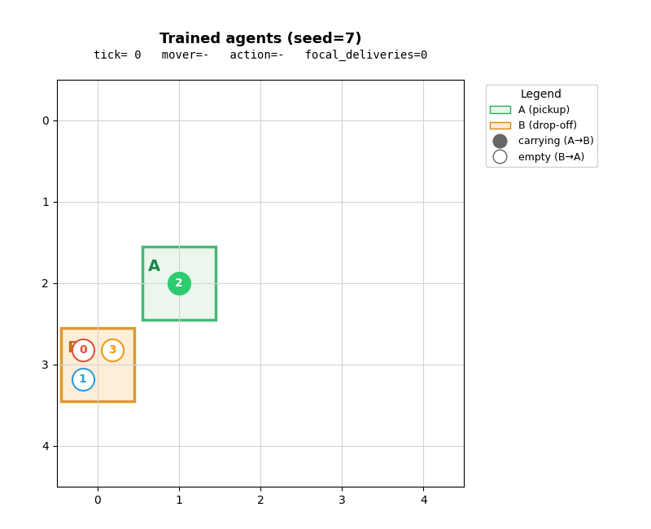

# Multi-Agent Coordination via Deep Q-Learning

Four reinforcement-learning agents that shuttle indefinitely between two cells on a 5×5 grid while learning to avoid each other.


<p align="center">
  
</p>

## Results

| Metric | Result | Target |
|---|---|---|
| Round-trip success rate (≤ 25 steps) | **94.8 %** | ≥ 75 % |
| Round-trip success rate (≤ 20 steps) | **94.8 %** | ≥ 85 % |
| Evaluation collisions (500 trials)   | **0**      | low |
| Training collisions                  | ~1 580     | < 4 000 |
| Wall-clock training time             | ~3.7 min   | < 10 min |

Reported on seed 0. Numbers vary by ±1 % across seeds; std-dev is ~0.6 % over 5 seeds.

## What is the task?

Four agents live on a 5×5 grid with two designated cells A and B. Each agent has a role:

- **Carrying (A→B):** holding an item, target cell is B.
- **Empty (B→A):** no item, target cell is A.

Agents pick items up automatically at A and drop them off at B. The role flips on arrival. The task is non-episodic — agents keep shuttling forever — and the catch is that **head-on collisions** (one carrying agent meeting one empty agent on the same cell) are penalised. Cells A and B themselves are collision-free.

Allowed actions: move N, S, E, W. No wait action.

## Approach

A single shared **Double-DQN** policy controls all 4 agents — they all sample actions from one network and write into one replay buffer. The network is a 2-layer MLP (9 → 128 → 128 → 4).

The state vector (9 floats) contains:

- vector to A and vector to B (normalised by grid size)
- carry flag
- 4 binary "opposite-role agent in this neighbour cell" sensors

Training uses a **3-phase curriculum** on the same 5×5 grid:

| Phase | n_agents | Steps | Purpose |
|---|---|---|---|
| 1 — pure navigation | **1** | 100 k | With one agent, collisions are mathematically impossible. The network learns "how to navigate" while burning **zero** of the collision budget. |
| 2 — sensor warmup | **2** | 40 k | Two agents introduce real sensor signals at a low collision rate. |
| 3 — full coordination | **4** | up to 200 k | All 4 agents, harshest collision penalty (-15). Stops early when mini-evaluation hits 93 %. |

The Q-network weights persist across phases.

## Design choices

- Round-robin agent updates. Each tick, exactly one agent acts. Removes a source of environment variance and makes the policy's credit assignment cleaner than fully-random update order.
- Local collision-detection in the state. The state vector includes 4 binary sensors for "opposite-role agent in each cardinal neighbour." Lets the policy react to a potential collision instead of only learning it from delayed reward.
- Curriculum learning. Three phases: 1-agent → 2-agent → 4-agent. The first phase teaches navigation while burning zero collisions. Cuts total training collisions ~3× vs single-phase training.

### Why the curriculum matters

Most training collisions happen in the first ~100 k steps when ε is high and the policy is essentially random. By making those first 100 k steps a single-agent setup, those collisions simply cannot occur. This is the main lever that brings training collisions from ~5 000 (single-phase) down to ~1 600 (curriculum).

### Reward shaping

| Component | Value | Purpose |
|---|---|---|
| Per-step penalty | -0.05 | encourage short paths |
| Progress shaping | +0.5 × Δ Manhattan distance to goal | dense reward signal |
| Pickup at A / delivery at B | +5 / +10 | reinforce the task |
| Collision penalty | -10 to -15 (rises across phases) | discourage head-ons |
| Adjacent-to-opposite-role | -0.2 to -0.3 | proactive collision avoidance |
| Oscillation (step back where you came from) | -0.3 | discourage stuck-in-corner loops |

## Repository structure

```
.
├── README.md
├── LICENSE
├── requirements.txt
├── configs/
│   └── default.yaml          # all hyperparameters
├── src/
│   ├── env.py                # GridWorld environment
│   ├── agent.py              # DQN network + Double-DQN agent
│   ├── train.py              # curriculum training loop
│   ├── evaluate.py           # spec-aligned eval + per-trial diagnostics
│   ├── visualize.py          # rollout capture + animation
│   └── cli.py                # train / eval / demo command-line interface
├── tests/
│   ├── test_env.py           # 12 tests on environment rules
│   └── test_agent.py         # 4 tests on agent / persistence
├── notebooks/
│   └── demo.ipynb            # walk-through notebook with inline animations
├── models/                   # saved checkpoints
└── assets/                   # generated GIFs and plots
```

## Quick start

```bash
git clone https://github.com/USER/multi-agent-coordination.git
cd multi-agent-coordination
pip install -r requirements.txt

# Train (≈ 4 minutes on CPU)
python -m src.cli train --output models/best.pt --seed 0

# Evaluate
python -m src.cli eval --checkpoint models/best.pt

# Generate a rollout GIF
python -m src.cli demo --checkpoint models/best.pt --output assets/rollout.gif --seed 7
```

All hyperparameters live in `configs/default.yaml`. Override by editing the YAML or pointing the CLI at a different config file: `--config configs/my_experiment.yaml`.

## Tests

```bash
pytest tests/ -v
```

16 tests cover the most error-prone parts of the environment (collision rules, role flips, grid bounds) and the agent (action validity, ε-schedule, save/load round-trip).

## What didn't work

Some things I tried and dropped:

- **Mixed-grid curriculum (10×10 → 8×8 → 5×5).** State semantics shift per grid size, the policy has to relearn each transition, and the 5×5 final-phase collision rate wasn't measurably lower than with a fixed-grid curriculum.
- **Skipping the 2-agent intermediate phase.** Going 1-agent → 4-agent directly meant the policy had no warning that sensor inputs ever fire, and early 4-agent training collisions spiked.
- **Larger network (3 layers, 256 units).** No improvement on this task — the state space is too small to benefit from extra capacity.

## Limitations

- The policy is specialised to this exact task: 5×5 grid, 4 agents, random A and B. It would not transfer to a 10×10 grid without retraining.
- The opposite-direction sensor uses only the 4-cell cardinal horizon. A wider sensor (8-neighbour, or radius 2) might cut residual eval collisions further.
- Six hand-tuned reward coefficients. Chosen by experiment; could be optimised further with hyperparameter search.


## Acknowledgements

Originally developed for FIT5226 Multi-Agent Systems at Monash University. The task specification (5×5 grid, 4 agents, head-on collision rules) comes from the unit's individual assignment brief.
Note - Restructured git style project from FIT5226 one ipynb file due to university academic policy, but same functionality.
