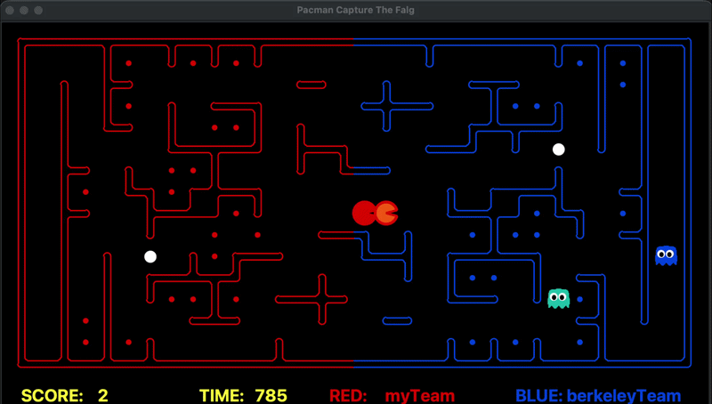

# 🎮 Pacman Capture the Flag — AI Agent

> Competitive multi-agent AI for the Berkeley Pacman Capture the Flag framework, built for FIT5222 Planning and Automated Reasoning at Monash University.



---

## Results

| Opponent | Red side | Blue side |
|---|---|---|
| Staff Baseline | 100% (20/20) | 100% (20/20) |
| Berkeley Team | 75% | 60% |
| Original submission | 95–100% | 90%+ |

Average winning margin vs baseline: **+4.95 points**

---

## Overview

This project implements a two-agent AI team for the [UC Berkeley Pacman Capture the Flag](http://ai.berkeley.edu/contest.html) framework. Two teams of agents compete on a divided maze — collecting food on the enemy side while defending their own.

Each agent operates under real constraints:
- **Partial observability** — opponents only visible within 5 tiles
- **Noisy sensors** — distance readings have ±6 error
- **1 second per move** — planning must be fast
- **No direct communication** — agents share state via class-level memory only

The map is split into red (left) and blue (right) halves. Agents become Pacman when crossing into enemy territory and ghosts on their own side. Eating a power capsule makes all enemy ghosts scared for 40 moves — a key tactical window.

---

## Architecture

The agent uses a **PDDL-lite hybrid** — PDDL handles high-level mode selection, Python handles all tactical decisions.

```
Every tick (fast):
  oscillation check → role assignment → mode dispatch → A* navigation

Only on state change (~10x per game):
  PDDL solver → high-level mode (ATTACK / RETURN / DEFEND / HUNT)
```

The key insight: PDDL solvers are too slow to run every tick (~50–200ms per call). Instead, a fingerprint of the game state is computed each tick. The solver only re-runs when something meaningful changes — carry count, ghost proximity, boundary crossing, invader visibility. This gives structured reasoning from PDDL without the latency cost.

---

## Key Features

**Scared ghost hunting**
When a capsule is eaten, enemy ghosts become scared for ~40 ticks. The agent detects this window and actively hunts scared ghosts instead of collecting food — each eaten ghost is a large score swing.

**Predictive ghost avoidance**
A* pathfinding avoids not just the ghost's current tile but its predicted next position based on movement direction. This prevents the agent walking into a ghost's path one step ahead.

**Cut-off intercept**
The defender doesn't chase invaders directly. It calculates a shadow point — the boundary tile the invader is heading toward — and intercepts there rather than chasing from behind.

**Adaptive return threshold**
How much food to carry before returning home adapts to game state. When all visible ghosts are scared, the threshold rises so the agent keeps collecting. When ghosts are close, it drops immediately.

**Guaranteed role split**
Exactly one attacker and one defender at all times. Assignment is dynamic — whoever is carrying food or already in enemy territory becomes the attacker. Both agents only attack when winning by a large margin or food is nearly gone.

**Oscillation detection**
Tracks position history across 8 ticks. If any tile appears 4+ times, the agent escapes using a ghost-distance scoring function instead of A*.

---

## How it works

```
chooseAction()
│
├── update memory (eaten food, ghost positions)
├── update shared state (both agents read each other)
├── assign roles (attacker / defender)
│
├── oscillation check → escape if stuck
│
├── _get_pddl_mode()  ← only recalculates when fingerprint changes
│     └── _run_pddl() → PDDL solver → first action name → Python mode
│
└── Python tactical layer
      RETURN  → A* to nearest home boundary tile (ghost-avoiding)
      HUNT    → A* to nearest scared ghost (ghost-avoiding off)
      CAPSULE → A* to nearest capsule
      ATTACK  → _best_food() scoring → A* to target
      DEFEND  → _cut_off() intercept → A* to shadow point
```

---

## Food target scoring

Food targets are scored rather than just picking the nearest:

```python
score = distance_to_food
      + 0.8 * distance_home          # prefer food closer to home when carrying
      - 1.5 * nearby_cluster         # prefer dense food clusters
      + corridor_depth_penalty       # avoid dead ends when carrying
      + danger_zone_penalty          # avoid tiles near ghosts
      + ally_spacing_penalty         # don't chase same food as teammate
      + carry_pressure               # return pressure increases with carry count
```

---

## Project Structure

```
├── myTeam.py       # agent (PDDL-lite hybrid)
├── myTeam.pddl     # PDDL domain file
└── docs/
    └── demo.gif
```

---

## Running locally

Requires the [Berkeley Pacman CTF framework](http://ai.berkeley.edu/contest.html) base files.

```bash
# run one game with display
python capture.py -r myTeam -b baselineTeam

# run 20 games without display (fast)
python capture.py -r myTeam -b baselineTeam -Q -n 20

# test both sides
python capture.py -r myTeam -b berkeleyTeam -Q -n 20
python capture.py -r berkeleyTeam -b myTeam -Q -n 20

# control one agent with keyboard
python capture.py --keys0
```

Base files needed in the same folder:

```
capture.py · captureAgents.py · game.py · util.py
baselineTeam.py · distanceCalculator.py · layout.py
lib_piglet/
```

---

## Tech

Python · PDDL · A* Search · Berkeley Pacman Framework · lib_piglet
