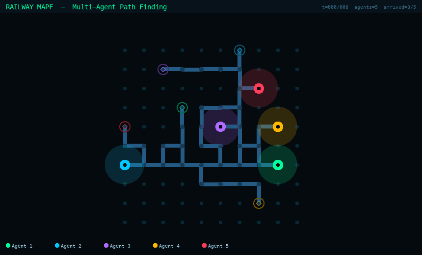

# 🚆 Railway Multi-Agent Path Finding (MAPF)

> Conflict-free path planning for trains on dynamic railway networks, built on the [Flatland](https://flatland.aicrowd.com) simulation environment.

---

## Overview

This project implements a suite of progressively complex path-finding algorithms for autonomous train agents navigating shared railway grids. The core challenge is coordinating multiple agents that share track — avoiding head-on collisions, swap conflicts, and cascading failures from unexpected malfunctions — all within strict time budgets.


Three planners are implemented, each building on the last:

| File | Algorithm | Problem |
|---|---|---|
| `single_agent.py` | Greedy best-first (Manhattan heuristic) | Single agent, no obstacles |
| `conflict_aware.py` | Time-space A\* | Single agent, moving obstacles |
| `mapf_planner.py` | Prioritised Planning + dynamic replanning | Multi-agent, malfunctions |

---

## Algorithms

### `single_agent.py` — Greedy Best-First Search

A direction-preferring greedy planner for isolated single-agent navigation. At each step the agent evaluates its valid rail transitions and greedily picks the one that minimises Manhattan distance to the goal.

**Preference order:** straight → right turn → left turn → reverse  
**Heuristic:** Manhattan distance  

Works well on simple layouts; no conflict awareness.

---

### `conflict_aware.py` — Time-Space A\*

Extends A\* into the time dimension so the agent can reason about *when* positions are occupied, not just *where*.

**Key design decisions:**

- **Conflict tables** are pre-built from existing agent paths: `vertex_conflicts[t]` holds positions occupied at time `t`; `edge_conflicts[t]` holds traversed edges, preventing head-on swaps.
- **Parent-pointer reconstruction** — the heap carries only `(f, tie, t, loc, direction)`; the full path is reconstructed via a `came_from` dict at goal time. This cuts heap memory significantly on large grids vs. storing the path list in every entry.
- **Proper A\* closed set** — a state is sealed when popped, not when pushed. This eliminates the redundant re-expansion that a push-only visited set allows.
- **Turn penalty** (+0.1) and **wait penalty** (+0.3) softly guide the planner toward straighter, more decisive routes.

---

### `mapf_planner.py` — Prioritised Planning + Malfunction Replanning

Full multi-agent planner with two phases: initial planning and online replanning.

#### Initial Planning (`get_path`)

Uses **Prioritised Planning**: agents are planned one at a time in priority order, each treating all previously planned paths as hard constraints.

**Priority metric:** slack = deadline − minimum travel distance. Tightest-deadline agents plan first.

The core single-agent subroutine (`_plan_single`) is the same time-space A\* as above, enhanced with:
- **Lateness penalty** — adds cost proportional to how far the estimated arrival exceeds the agent's deadline, softly pushing the planner to find faster routes.
- **Adaptive wait penalty** — waiting costs less early in a journey (when the agent hasn't yet made progress) to avoid over-penalising legitimate blocking situations.
- **Goal reservation** — finished agents' goal cells are blocked for a short window after arrival, preventing live agents from colliding with parked ones.

#### Replanning (`replan`)

Called mid-episode when malfunctions or collisions occur. Three-pass approach:

```
1. Insert wait steps  →  extend malfunctioning agents' paths in-place
2. Detect secondary conflicts  →  scan every other agent's remaining path 
                                   against the updated malfunction paths
3. Replan affected agents  →  replan only those with newly created conflicts,
                               preserving the prefix up to current_timestep
                               and replanning the suffix from current position
```

The original approach only did pass 1. Passes 2-3 prevent the cascading silent failures where inserting a wait for one agent invalidates another's path without detection.

---

## Project Structure

```
.
├── single_agent.py          # Greedy single-agent planner
├── conflict_aware.py        # Time-space A* with conflict avoidance
├── mapf_planner.py          # Multi-agent prioritised planning + replanning
├── piglet.py                # Flatland runner utilities
├── setup.py                 # Environment setup
├── single_test_case/        # Test instances for single-agent problems
├── multi_test_case/         # Test instances for multi-agent problems
├── lib_piglet/              # Supporting library
└── example/                 # Example configurations
```

---

## Setup

**Requirements:** Python 3.8+

```bash
# Clone the repo
git clone https://github.com/<your-username>/railway-mapf.git
cd railway-mapf

# Install dependencies
pip install -r requirements.txt

# Or run setup directly
python setup.py install
```

---
## Before running
To enable flatland
```bash
conda create flatland-rl
conda activate flatland-rl
```
## Running

Each planner can be run standalone against its test suite:

```bash
# Single agent — greedy planner
python single_agent.py

# Single agent — with conflict avoidance
python conflict_aware.py

# Multi-agent — full MAPF with replanning
python mapf_planner.py
```

To test a specific level and instance, edit the flags at the top of any file:

```python
test_single_instance = True
level = 1   # level number
test  = 5   # test case number
```

To enable debug output or the visualiser:

```python
debug      = True
visualizer = True
```

---

## Key Concepts

**Vertex conflict** — two agents occupy the same cell at the same timestep.  
**Edge (swap) conflict** — two agents traverse the same edge in opposite directions in the same timestep.  
**Time-space A\*** — standard A\* extended with time as a third dimension, enabling conflict-aware planning.  
**Prioritised Planning** — a greedy decomposition of MAPF: solve agents sequentially, each treating prior solutions as obstacles. Fast but suboptimal; completeness depends on ordering.  
**Malfunction** — a stochastic delay where an agent is forced to stop for `k` timesteps. The replanner must extend the affected agent's path and repair any cascading conflicts.

---

## References

- Flatland Challenge — [flatland.aicrowd.com](https://flatland.aicrowd.com)
- Sharon et al., *Conflict-Based Search for Optimal Multi-Agent Path Finding* (AAAI 2012)
- Silver, *Cooperative Pathfinding* (AIIDE 2005) — foundational time-space A\* formulation
